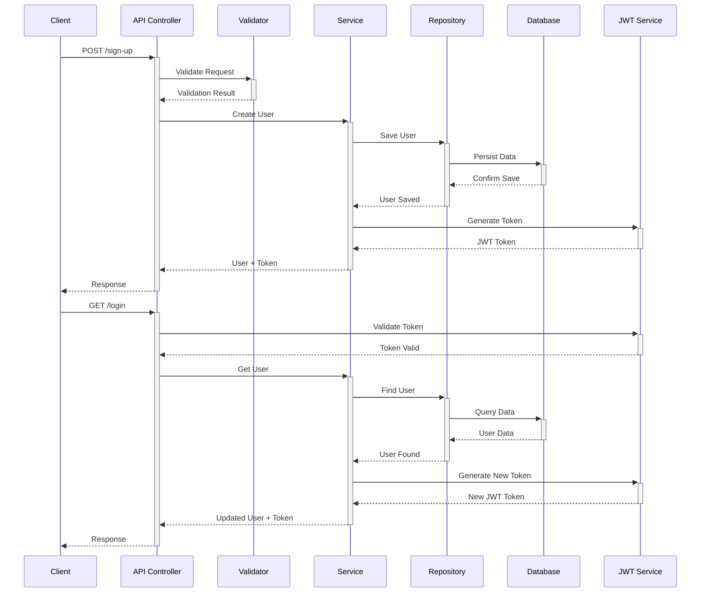
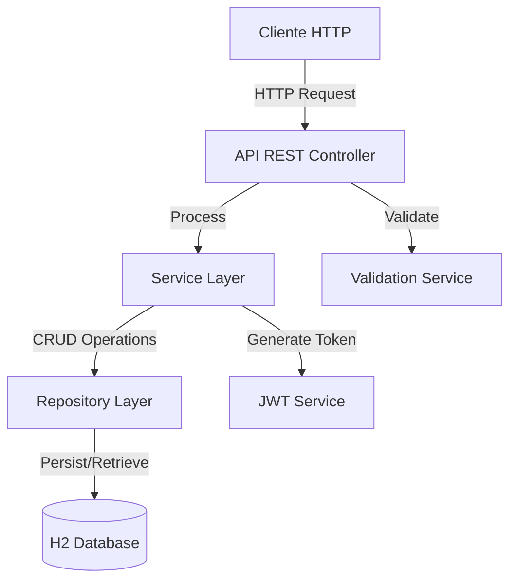

# User Management Microservice

Este microservicio proporciona endpoints para la gestión de usuarios, incluyendo registro y login.

## Desarrollador
👤 **Junior Pedro Pecho Mendoza**  
💼 **Software Engineer**

## Requisitos

- Java 11
- Gradle 7.4
- Spring Boot 2.5.14

## Características

- Registro de usuarios con validación de correo y contraseña
- Login mediante token JWT
- Base de datos H2 en memoria
- Webflux para operaciones reactivas
- Pruebas unitarias con JUnit y cobertura >80%

## Construcción y Ejecución


1. Construir el proyecto:
```bash
./gradlew build
```

2. Ejecutar la aplicación:
```bash
./gradlew bootRun
```

La aplicación estará disponible en `http://localhost:8080`

## Endpoints

### Sign Up
POST `/api/sign-up`
```json
{
  "name": "Juan Rodriguez",
  "email": "juan2@rodriguez.org",
  "password": "aA12bdfgh34",
  "phones": [
    {
      "number": 1234567,
      "citycode": 1,
      "contrycode": "57"
    }
  ]
}
```

### Login
GET `/api/login`
Header: `Authorization: Bearer <token>`

### Actuator
Los endpoints de Actuator están disponibles en `http://localhost:8080/actuator`.

### OpenAPI (Swagger UI)
La documentación de la API está disponible en:
- `http://localhost:8080/v3/api-docs`: Endpoint para la especificación OpenAPI en formato JSON
- `http://localhost:8080/swagger-ui.html`: Interfaz de usuario de Swagger para explorar y probar los endpoints


## Estructura del Proyecto

- `/src/main/java/com/user/management`
    - `/controller` - Controladores REST
    - `/model` - DTOs
    - `/entity` - Entidades
    - `/repository` - Interfaces de repositorio
    - `/service` - Lógica de negocio
    - `/config` - Configuraciones de Spring
    - `/exception` - Manejo de excepciones

## Diagramas

Los diagramas UML se encuentran en la carpeta `/diagrams`:
- `component-diagram.png` - Diagrama de componentes
- `sequence-diagram.png` - Diagrama de secuencia
## Diagrama de Secuencia



## Diagrama de Componentes


